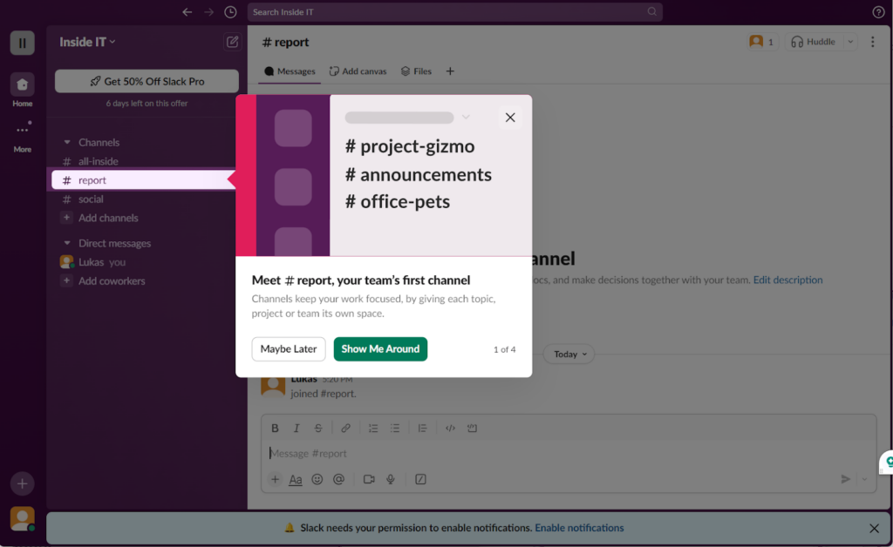

[Link](https://ask-and-plan--rammyking456.replit.app/)

## Commands to run the project locally
To run both services locally, you'll need Node.js v 24+(since typescript node code is supported from ~24.x onwards) and `pnpm` installed. Then:

1. Install dependencies (once, from the project root):

```
pnpm install
```

2. Run the API server (in one terminal):

```
pnpm --filter @workspace/api-server run dev
```

This builds and starts the backend on port 8080.

3. Run the SyncBoard frontend (in a second terminal):

```
PORT=5173 BASE_PATH=/ pnpm --filter @workspace/syncboard run dev
```

This starts the Vite frontend dev server. Use whatever available port if 5173 is not available on your machine.

4. Open the app

Go to http://localhost:5173 (or whatever port Vite printed or whatever port you chose) in your terminal.


## Architecture overview
* For the backend, we’ll use node.js server with socket.io library since gives us the concept of rooms outright. We store a separate Map data structure where we associate a user id as the key and user’s ‘name’ as the value. Whenever we need to send a list of user names to the client, we find the user names by first checking the room’s keys, which are the user ids and loop over them and use the second map to obtain the user names and send that list back to the client.
* Regarding storing path and text data, we store the shared data for the room in a Map, where, the key would be the object(path or text block’s ID) and the value would be a JSON object of type originally sent by the client and then broadcast to all users in the room:
```
{
    isDrawing: boolean,
    isLock: boolean,
    type: ‘path’ | ‘text’,
    <...rest of the properties of this JSON needed for both the path shadow array or the text block so that they can be used by the frontend/client to draw them programmatically onto the canvas>
}
```
* User room enter errors, user joining and leaving room each emit toast notifications.
* Conflicts during lock acquisition in edit mode will throw an appropriate toast notification as well.
* Use of shadow canvas when moving objects in edit mode.
* Detailed prompt instructions given in prompt.odt file, actual prompt starts from 'Technical & human level instructions' heading/section.

## Ground rules
* Have all the backend code in one single index.ts file.(there are other files added by the LLM to add middleware like logger, etc.. which are useful for debugging)
* Use no or minimal amount of libraries. For frontend, the project should be in react with typescript and stick to tailwind classes for styling and toast notifications and use pure JS rather than any libraries or frameworks and use socket.io frontend library for communication with the socket.io node server.
* Use vite as the bundler for frontend repo for one shot bundling capability.
* Use prettier, eslint with industry standard defaults for both frontend and backend repositories.
* Use design system and color scheme from the home page mock image(designed using Google Stitch) attached below in rendering both ‘Home’ and ‘Canvas’ page.
* Have all the source code for both frontend & backend repo in a src/ directory.
* Break up frontend code into meaningful components with proper state management using react context for global state management and have the ‘socket’ object in the client as a global state value so that it’s accessible in any component.
* Common utils and styles should be in a single utils.ts and main.css file respectively. Component related utils and css files should live along with the component.ts in their own folder inside src/components directory.

## Real-time synchronization approach
* For real time sync, events are emitted on mousemove in both drawing & edit mode.
* For realtime cursor position of other users in the room, we emit their position on a transparent canvas every 1 second and each user has their own transparent canvas.

## Performance considerations
* Emitting events on every mousedown, mousedown and mouseout so great user experience but comes at the cost of heavy network bandwidth.
* What I actually wanted (prompt issue after reviewing it retroactively) was to only emit update events on for mouseup and mouseout potentially avoiding hundreds if not thousands of mousemove event emits for MVP and have an incremental mousemove emit based approach so this would be a tasked as a future performance fix.

## Trade-offs and assumptions
* Edit mode:
    * Plain move mode: Move objects directly by hovering on them to get the hitzone and then drag and drop into desired co-ordinates. Not the most clean when there are thousands of objects and it's getting harder to get the hit/hand cursor on the desired object. Also how do you deal with conflicts.

    * Soft shared mode: Everyone can view everyone else's objects on the canvas in drawing mode, but only the owner of the object can control(move & delete) the object. But is it truly shared collab? can make it work with text or new UX onboarding workflow(see attached image below).
    

    * Current approach: Introduce a locking mechanism where only one user can ever get the right to move/delete the object and once they're set in place. What happens if a person holds the lock an object for too long. Currently no functionality to get around that but can be added as a future feature implementation.
    (time vs feature deficiency tradeoff)


## Known Bugs
* Auto disconnect of the user after few minutes(reproducible only on replit deployed demo but not locally)

## Production ready checklist & future features
* Handle temporary glitches/disconnects of clients.
* Optimize the bundle size if not already done (Vite should've done a pretty good job already).
* Use redis in place of in memory Map. Saves state in the event of a crash and restores state after server restarts.
* Likely optimize database due to tiering and scale that before the throughput of db calls, exceeds websockets. Utilize worker threads module to utilize all cores/threads(unlikely to use this since operations of I/O heavy but not CPU bound). Bun/Rust > Node.js

* Have a monorepo with same async API interface shared between server and client & also since package management is efficient, upgrade once if vulnerabilities occur. Run playwright tests & screenshot testing locally with full, login and test chat as a user and after merge build as well so that we have redundant areas of testing for intercepting bugs quickly.

* Clear board functionality:
Similarly, if someone is is edit mode, how should the clear board functionality be handled for them. Should clear board functionality be also locked similar to primitive locking functionality for all other users. If not, how to handle this?
Have to handle the users receiving the clear board event at different states of their lifetime.

* Assigning names to entries(paths & text-boxes) of the list in edit mode, so that they can be filtered later for easy retrieval and visual aid when there are hundreds if not thousands of items in the list.
The list can be virtualized using libraries like tanstack-query, if after benchmarking lag is significant when there  are hundreds if not thousands of items in the list when in this mode.

* Used context instead of redux, because it's a complex app but not too complex for redux and. Redux over context but time travel debugging and redux devtools and in a project even with medium complexity but collaboration with multiple team members you'd like/want to use redux. and go into debugging example.

* Instead of object with keys like isLock, isDrawing, you can have an array with 0/1 for false/true at specific positions and the contract is established through using the same interface/type by both server and client codebases, already using monorepo.